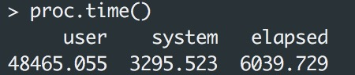
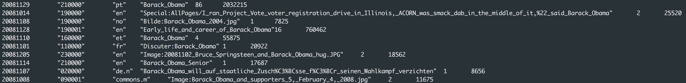

```{r setup, include=FALSE}
knitr::opts_chunk$set(echo = TRUE)
```

## Problem 1

#(a)

Their simulation study tests a single normal vensus a two-component normal mixture and a two-component normal mixture versus a three-component normal mixture and the rate of convergence to asymptotic distribution.

In conclusion, they investigate the finite sample properties of the test.

They use simulated significance levels to assess their method and simulated powers in percentages to assess their power study.

#(b)

They choose the EM algorithm to obtain the MLEs of the parameters with 100 sets of random starting values. And they considered the ad hoc adjusted test statistic to increase the convergence rate. When they tested the simulated powers, they choose to use different mixing proportion, sample sizes and distance values.

The samples were generated from standard normal distribution. Different configurations including mixing proportion, sample sizes and distance values may impact the power result.

Authors considered that there is no strong evidence that the power depends on the mixing proportion which maybe not very useful to consider.

#(c)

Table 2:

Table 2 shows that different simulated powers statistics in percentages of the adjusted and unadjusted tests for testing a single normal versus a two-component normal mixture varying due to different values of mixing proportion, sample size and D values.

Table 4 shows that different simulated powers statistics in percentages of the adjusted and unadjusted tests for testing a two-component normal mixture versus a three-component normal mixture varying due to different values of sample size, $D_1$ values and $D_2$ values.

The results make sense because the power more likely to increase when sample size, mixing proportion and D values increase.

#(d)

Overall, their tables represent their result in a relative good form. However, for table 1, I think it will be more representative and intuitive to combine the result of unadjusted test and adjusted test to make the comparison more clearly.

Besides, plots maybe more helpful for reader to grasp the properties and convergence trend.

## Problem 2

```{r problem_2}
library(RSQLite)
drv <- dbDriver("SQLite") 
dir <- 'data' # relative or absolute path to where the .db file is
dbFilename <- 'stackoverflow-2016.db'
db <- dbConnect(drv, dbname = file.path(dir, dbFilename))
dbGetQuery(db, "select count(distinct userid) from(
        select displayname, userid from
        questions Q join users U on U.userid = Q.ownerid
        join questions_tags T on Q.questionid = T.questionid
        where tag like '%apache-spark%'
        except
        select displayname, userid from
        questions Q join users U on U.userid = Q.ownerid
        join questions_tags T on Q.questionid = T.questionid
        where tag like '%python%')")
```

## Problem 3

I want to investigate the total number of hits which refers to 'holiday' and 'vacation'. Besides, according to different language, I compute the fraction of hits related to 'holiday' and 'vacation' to the total hits of each language to figure out the behavior of 'holiday' hits of different language. Maybe we can find something interesting such as people of what country tend to search something related to 'holiday' more often on Wiki considering October-December include many holidays.

The pyspark code is showed in the following chunk.

```{python, eval =FALSE}
from pyspark import SparkConf, SparkContext
from pyspark.sql import SQLContext
dir = '/global/scratch/paciorek/wikistats_full'
sc = SparkContext.getOrCreate()
sqlContext = SQLContext(sc)
lines = sc.textFile(dir + '/' + 'dated')

from pyspark.sql import SQLContext, Row
import numpy as np
import pandas as pd
import re
from operator import add
import pyspark.sql.functions as F

# self define filter function
def remove_short_lines(line):
    vals = line.split(' ')
    if len(vals) < 6:
        return(False)
    else:
        return(True)

# self define function to creat more readable rows
def create_Row(line):
    p = line.split(' ')
    return(Row(date = int(p[0]), hour = int(p[1]), lang = p[2],  site = p[3],
               hits = int(p[4]), size = int(p[5])))

#pre-processing
rows = lines.filter(remove_short_lines).map(create_Row)
df = sqlContext.createDataFrame(rows)

# using sql in pyspark
df.registerTempTable("wikiHits")  # name of 'SQL' table is 'wikiHits'
# collect all the rows related to holiday/vacation
subset = sqlContext.sql(
"SELECT * FROM wikiHits WHERE (UPPER(site) LIKE '%VACATION%' OR UPPER(site) LIKE '%HOLIDAY')")

# compute the sum of hits related to holiday
holiday_hits = subset[['lang','hits']].groupBy('lang').sum()
holiday_hits = holiday_hits.withColumnRenamed("sum(hits)", "hits_holiday")

# compute the sum of hits
whole_hits = df[['lang','hits']].groupBy('lang').sum()
whole_hits = whole_hits.withColumnRenamed("sum(hits)", "hits")

# merge dataframes
new_df = holiday_hits.join(whole_hits, on=['lang'], how='left_outer')

# retain three significant digits
result_df = new_df.withColumn("Fraction", (F.col("hits_holiday") / F.col("hits")))

# order and select
result_df.registerTempTable("HolidayHits")
result = sqlContext.sql(
"SELECT lang, Fraction as Holiday_fraction FROM HolidayHits ORDER BY Holiday_fraction desc limit 20")

result.show()

# output
outputDir = '/global/scratch/wejie_yuan/holiday_hits'
result.write.format('csv').option("delimiter", "|").save(outputDir)
```

To run our pyspark code in background, we submit our <job>.sh to savio, which is showed in the following chunk.

```{bash, eval=FALSE}
#!/bin/bash
#
# SLURM job submission script Spark example
#
# Job name:
#SBATCH --job-name=q3
#
# Account:
#SBATCH --account=ic_stat243
#
# Partition:
#SBATCH --partition=savio
#
# Resources requested:
#SBATCH --nodes=4
#
# Wall clock limit:
#SBATCH --time=3:00:00
#
module load java spark/2.1.0 python/3.5 
source /global/home/groups/allhands/bin/spark_helper.sh
spark-start
spark-submit --master $SPARK_URL /global/scratch/wejie_yuan/q3.py
spark-stop
```

Then we use R to read the generated .csv file and do some plotting and analysis.

```{r}
df <- read.csv("part-00000-208ed69f-d32e-4e3f-a393-45bbbce27fee.csv",header= FALSE,sep="|")
library(ggplot2)
ggplot(data=df, aes(x=V1, y=V3)) +
  geom_bar(stat="identity", color="blue", fill="white") +
  theme(axis.text.x = element_text(angle = 90, hjust = 1)) +
  ggtitle("Fraction of Hits Related to Holiday Vs Language") +
  xlab("Language") + ylab("Fraction of Hits Related to Holiday")
```

It seems that people speaking en.q, nl.q, nl.s and ht.d tend to search something related to 'holiday' and 'vacation', which are corresponding to people living in certain region (I can only find that 'nl' is corresponding to 'Dutch' online). It is quite important information to some travelling agencies. They can attach more importance to construct attractive website in certain language to make more profit.

We can also check the total number of hits related to 'holiday' and 'vacation' based on a new dataframe without the row corresponding to 'en'. Because hits refers to pages in 'en' and 'en.q' are so large that may hide behaviors of hits refering to pages in other language.

```{r}
ggplot(data=df[df['V1']!='en' &  df['V1']!='en.q',], aes(x=V1, y=V2)) +
  geom_bar(stat="identity", color="blue", fill="white") +
  theme(axis.text.x = element_text(angle = 90, hjust = 1)) +
  ggtitle("Total Hits Related to Holiday Vs Language") +
  xlab("Language") + ylab("Total Number of Hits Related to Holiday")
```

## Problem 4

#(a)

The code is showed in the following chunk.

```{r, eval=FALSE}
# set dir
dir = '/global/scratch/paciorek/wikistats_full/dated_for_R'
files = list.files(dir)

# load needed packages
require(parallel) # one of the core R packages require(doParallel)
require(doParallel)
library(foreach)
library(readr)

# detect number of cores
nCores <- detectCores()
registerDoParallel(nCores)

# number of files
nSub <- 960

# measure system time to evaluate the efficiency of parallelization
system.time(
result <- foreach(i = 1:nSub) %dopar% {
  lines <- read_delim(file = paste(dir,files[i],sep='/'),
                             delim=' ',quote="",col_name=FALSE)
  match_index = grep('Barack_Obama',lines$X4)
  lines[match_index,] # this will become part of the out object 
})

# bind the result together
result_df <- do.call(rbind.data.frame, result)
# output result .txt files
write.table(result_df,'/global/scratch/wejie_yuan/result.txt', sep="\t",
            col.names = FALSE, row.names = FALSE)

```


Then we submit our <job>.sh to savio, which is showed in the following chunk.

```{bash, eval=FALSE}
#!/bin/bash
# Job name:
#SBATCH --job-name=ps6
#
# Account:
#SBATCH --account=ic_stat243
#
# Partition:
#SBATCH --partition=savio
#
# Wall clock limit:
#SBATCH --time=02:00:00
#
## Command(s) to run:
module load r r-packages
R CMD BATCH --no-save ps6.R ps6.out
```

After the job done, we check 'ps6.out' and find all the information printed in the process of operation.

```{bash, eval=FALSE}
tail ps6.out
```

```{r pic1, echo=FALSE, out.width = '100%'}

```

```{bash, eval=FALSE}
wc -l result.txt
```

```{r pic2, echo=FALSE, out.width = '100%'}

```

And we can also see the first several lines of 'result.txt' to check if we have done our job in a right way.

```{bash, eval=FALSE}
head -10 result.txt
```

```{r pic3, echo=FALSE, out.width = '100%'}

```

It seems that we have collected all the the rows that refer to pages where "Barack_Obama" appears. The whole .txt file is quite verbose to show in pdf. So I upload it with my .Rmd file to github.

#(b)

When Professor Chris runs the Spark code provided with Unit 7, it takes ~15 minutes using 96 cores to create the filtered dataset that just has the Obama-related webpage traffic using Spark.

As for parallelized R code, which is runned in a single node using 24 cores, it should takes ~60 minutes theoretically if parallelized R has the same efficiency as that of Spark. However, in fact, parallelized R code takes around ~100 minutes to do the filtering. So, we may reach the conclusion that PySpark has higher efficiency than parallelized R while doing filtering in parallelization.

