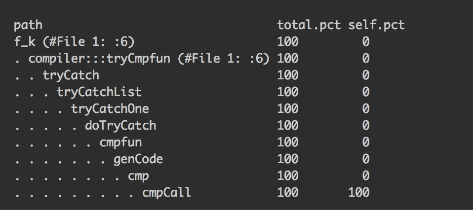
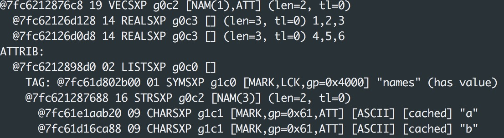
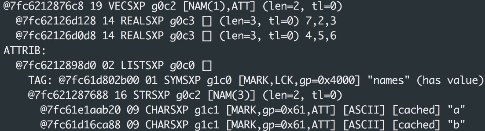
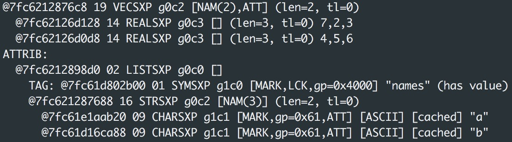
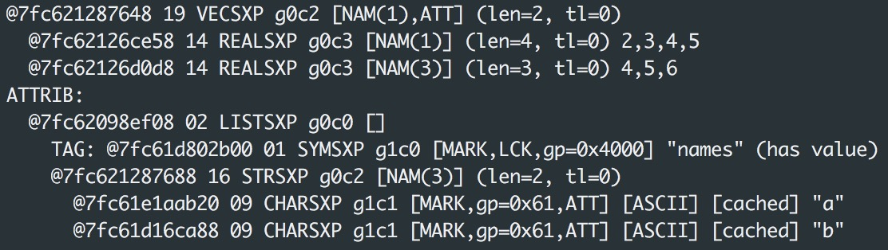
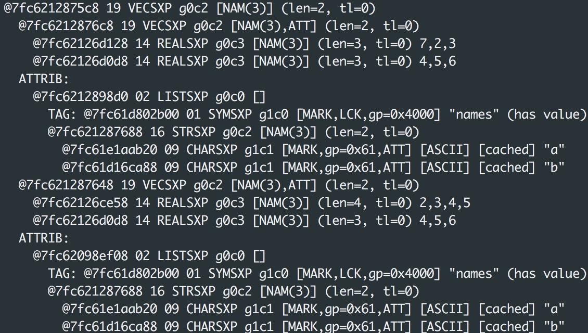
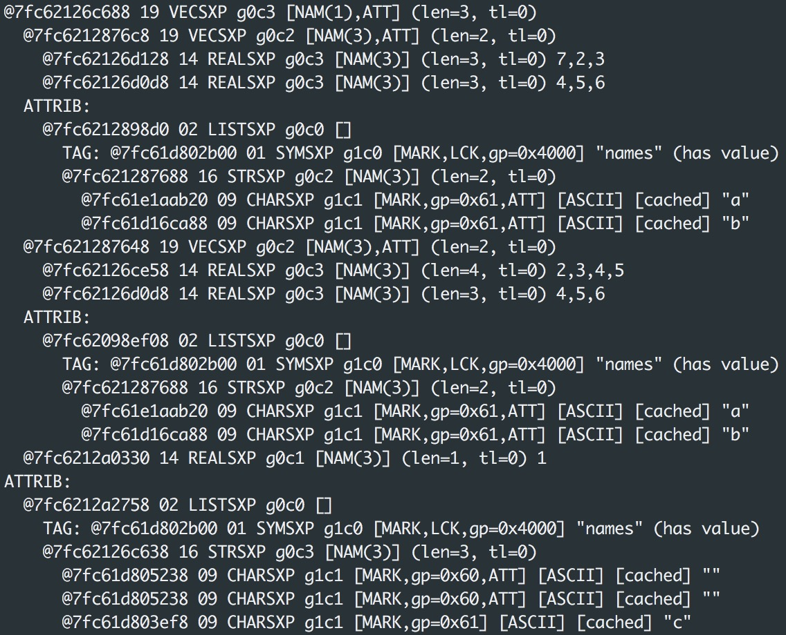

```{r setup, include=FALSE}
knitr::opts_chunk$set(echo = TRUE)
require(rbenchmark)
require(proftools)
require(pryr)
```

## Answer for Problem 1

Q: 

Consider the function closure example in on page 65 of Section 6.10 of Unit 4. Explain what is going on in make_container() and bootmeans(). In particular, when one runs make_container() what is returned? What are the various enclosing environments? What happens when one executes bootmeans()? In what sense is this a function that “contains” data? How much memory does bootmeans use if n = 1000000?

A:

```{r}
make_container <- function(n){ 
  x <- numeric(n)
  i <- 1
  function(value = NULL) {
    if (is.null(value)) { return(x) } else {
      x[i] <<- value
      i <<- i + 1 }
   }
} 
nboot <- 100
bootmeans <- make_container(nboot)
data <- faithful[,1] 
for (i in 1:nboot)
  bootmeans(mean(sample(data,length(data),replace=TRUE)))
```

The following code helps explain things.
```{r}
make_container
```
```{r}
make_container(n=10)
```

When we call 'make_container()', R returns a function with specified n. In 'make_container()' function, it generates a numeric object with n entries and set the initial index as 1. There is a nested function defined in the frame of 'make_container()' function call. So now 'bootmeans()' is assigned as the nested function of 'make_container()' with specified n=100. When one calls 'bootmeans(Value)' function, the bootmeans will check whether 'Value' is null. If it is null, the 'bootmeans()' function will directly return current 'x'. If not, the 'bootmeans(Value)' will assign 'Value' to x[i] and move the index to the next position. This operation will change the variable 'x' defined in the frame of 'make_contrainer()' function call.

Then, in each loop of 'for', it calls 'bootmeans()' to assign the value of 'mean(sample(data,length(data),replace=TRUE))' to 'x' sequentially. The value of 'mean(sample(data,length(data),replace=TRUE))' is compute the mean of sample derived from 'faithful[,1]' of which sample size equals to length of 'faithful[,1]' and sampling method is with replacement.

As a result, now 'x' is a numeric object with n entries and its i(th) entry is mean of i(th) sample from 'faithful[,1]' derived above.

```{r}
bootmeans()
```

Now, we call function 'bootmeans()', because the input argument value is null, it returns 'x' showed above.

Various Enclosing Environments

```{r}
environment(make_container)
```
```{r}
environment(bootmeans)
```

* The enclosing environment for 'make_container()', which is global environment of R.
* The enclosing environment for 'bootmeans()' where 'x' is defined and can be called.

The function 'make_container()' contains data in the sense that the values of elements in 'x' are only enclosed in the function frame instead of the global enviroment. As a result, if we change the variable 'x' in the global enviroment, it will have no effect on the 'x' in the local enviroment of this function.

```{r}
nboot <- 0
bootmeans <- make_container(nboot)
data <- faithful[,1] 
for (i in 1:nboot)
  bootmeans(mean(sample(data,length(data),replace=TRUE)))
bootmeans()
gc()
```
```{r,results="hide"}
nboot <- 1000000
bootmeans <- make_container(nboot)
data <- faithful[,1] 
for (i in 1:nboot)
  bootmeans(mean(sample(data,length(data),replace=TRUE)))
bootmeans()
```
```{r}
gc()
```

If n = 1000000, bootmeans uses about 7.6 Mb of memory. We can regard this number is equal to 8 Mb. To be more specific, x contains 1000000 numbers, and each number occupies 8 bytes in memory.

## Answer for Problem 2

Q:

However that is a lot slower than some other ways we might do it. How can we do it faster? Hint: think about how you could transform the matrix of probabilities such that you can do vectorized operations without using sample() at all. Hint #2: there is a very fast solution that uses a loop.

A:

```{r}
n <- 100000

p <- 5 ## number of categories

tmp <- exp(matrix(rnorm(n * p), nrow = n, ncol = p)) 
probs <- tmp / rowSums(tmp)

smp <- rep(0, n)

## slow approach: loop by row and use sample() 
set.seed(1)
sample_slow <- function(){
  for(i in seq_len(n)) smp[i] <- sample(p, 1, prob = probs[i, ])
}
system.time(sample_slow())
```
```{r}
for (i in 2:5){
  probs[,i]=probs[,i]+probs[,i-1]
}
sample_fast<-function(){
  rand <- runif(n)
  tf <- rand < probs
  return (max.col(tf,'first'))
}
system.time(sample_fast())
```

My solution has a speedup around 60 times the original loop above, which seems to satisfy the requirement. Then we use 'benchmark' to compare two solutions to make the result clearer.

```{r}
benchmark(sample_slow(), sample_fast(),
replications = 20, columns=c('test', 'elapsed', 'replications','relative'))
```

## Answer for Problem 3

# (a)

```{r}
sum_f <- function(n,p,phi){
  f<-function(k){
    log = lchoose(n,k)+(1-phi)*(k*log(k)+(n-k)*log(n-k)-n*log(n))+
      k*phi*log(p)+(n-k)*phi*log(1-p)
    
    # specify the situation of k=n and k=0
    if(k==n||k==0){return(p**(k*phi)*(1-p)**((n-k)*phi))}
    
    return (exp(log))
  }
  return(sum(sapply(seq(from=0,to=n),FUN = f)))
}

# test the case of n=10
sum_f(10,0.3,0.5)
```

If we don’t do the calculation on the log scale, when n is large, some terms of summation will be extremely small so that it may go beyond the 16th decimal place accuracy of R representation of a number, which leads to tiny error. However, the accumulation of such small errors may leads to significant bias of our result.

On the other hand, 'choose(n,k)' will become extremely big when n increase up to 2000. It will generate large number that exceeds maximal number of R's handling.

And log scale can transform these two kinds of numbers to more smooth and modest numbers. At the meantime, all of original information will be stored. To sum up, our case benefits from log scale a lot.

#(b)

There are two ways to address this calculation in fully vectorized fashion. We can compare their performance later.

* Method I

Build the nest function inside the summation function to carry out the vectorized calculation.

```{r}
sum_f_vect <- function(n,p,phi){
  f<-function(k){
    log = lchoose(n,k)+(1-phi)*(k*log(k)+(n-k)*log(n-k)-n*log(n))
    log = log + k*phi*log(p)+(n-k)*phi*log(1-p)
    return (exp(log))
  }
  return(sum(f(1:(n-1))+(1-p)**(n*phi)+p**(n*phi)))
}
sum_f_vect(2000,0.3,0.5)
```

* Method II

Sum directly in fully vectorized way.

```{r}
sum_vect <- function(n,p,phi){
k = 1:(n-1)
sum(exp(lchoose(n,k)+k*log(k) + (n-k) * log(n-k) - n*log(n) + 
          phi * (n * log(n) - k * log(k) - (n-k) * log(n-k)) + 
          k*phi*log(p) + (n-k)*phi*log(1-p)), exp(n*phi*log(1-p)), exp(n*phi*log(p)))
}
sum_vect(2000,0.3,0.5)
```

Rough Comparision

```{r}
n<-500000;p<-0.3;phi=0.5
benchmark(sum_f_vect(n,p,phi), sum_f(n,p,phi), sum_vect(n,p,phi),
          replications = 20, columns=c('test', 'elapsed', 'replications','relative'))
```

Systematic Comparision Using Relative Timing

```{r}
# take a seqence of n ranging from 10 to 2000 with step size 10
n = seq(from = 10, to = 2000, by = 50) 

sum_f_time = c() 
sum_f_vect_time = c()
sum_vect_time=c()

for (i in 1:length(n)){
  sum_f_vect_time[i] = benchmark(sum_f_vect(n[i],p,phi), sum_f(n[i],p,phi), sum_vect(n[i],p,phi),
                           replications = 100,
                           columns=c('test','elapsed','replications',
                                     'relative'))$relative[1]
  sum_f_time[i] = benchmark(sum_f_vect(n[i],p,phi), sum_f(n[i],p,phi), sum_vect(n[i],p,phi),
                           replications = 100,
                           columns=c('test','elapsed','replications',
                                     'relative'))$relative[2]
  sum_vect_time[i] = benchmark(sum_f_vect(n[i],p,phi), sum_f(n[i],p,phi), sum_vect(n[i],p,phi),
                           replications = 100,
                           columns=c('test','elapsed','replications',
                                     'relative'))$relative[3]
}
time_data <-
  data.frame(
    n = seq(from = 10, to = 2000, by = 50),
    sum_f_vect_timing = sum_f_vect_time,
    sum_f_timing = sum_f_time,
    sum_vect_timing = sum_vect_time)
```

When n is small, 'benchmark' generate some 'NA' data in 'relative' column. We assign zeros to these positions.

```{r}
time_data[is.na(time_data)] <- 0
library(ggplot2)
ggplot(time_data, aes(n)) + 
  geom_line(aes(y = sum_f_vect_timing, colour = "sum_f_vect_timing")) + 
  geom_line(aes(y = sum_f_timing, colour = "sum_f_timing")) +
  geom_line(aes(y = sum_vect_timing, colour = "sum_vect_timing")) +
  ylab('Relative Timing')
```

According to the above graphic, we can know that Method I in (b) has the best performance in speed compared with the other two methods. As n goes from 10 to 2000, the relative timing increases from around 5 to around 20 fluctuating in the range between 15 and 20. 

That is, when n is small, the difference between 'sapply()' and fully vectorized fashion in this case is not that obvious. And as n increases, the difference in speed becomes larger and stay relatively stable when n is fairly large.

The relative timing will exceed 20 times when n is extremely large. It has been showed in 'Rough Comparision' section. But considering it's time-consuming to draw a plot based on such large n, we do not show the entire result here.

#(c)

To assess the steps in your code for (b) that are using the most time.

```{r,eval=FALSE}
n<-2000;p=0.3;phi=0.5
f_k <- function(n,k,p,phi){
  log = lchoose(n,k)+(1-phi)*(k*log(k)+(n-k)*log(n-k)-n*log(n))+
    k*phi*log(p)+(n-k)*phi*log(1-p)
  return (exp(log))
}

library(proftools)
pd <- profileExpr(
  {
    for(k in 1:(n-1)){
      result_zero <- (1-p)**(n*phi)
      result_n <- p**(n*phi)
      den <- sum(f_k(n,k,p,phi))}
  }
)
hotPaths(pd)
```
```{r pressure0, echo=FALSE, out.width = '100%'}

```

According to the result showed above, I consider the Method I has best performance in speed as my final solution.

## Answer for Problem 4

Q:

This question explores memory use and copying with lists. In answering this question you can ignore what is happening with the list attributes, which are also reported by .Internal(inspect()).

(a) Consider a list of vectors. Modify an element of one of the vectors. Can R make the change in place, without creating a new list or a new vector?

(b) Next, make a copy of the list and determine if there any copy-on-change going on. When a change is made to one of the vectors in one of the lists, is a copy of the entire list made or just of the relevant vector?

(c) Now make a list of lists. Copy the list. Add an element to the second list. Explain what is copied and what is not copied and what data is shared between the two lists.

(d) Run the following code in a new R session. The result of .Internal(inspect()) and of object.size() conflict with each other. In reality only ~80 MB is being used. Show that only ~80 MB is used and explain why this is the case.

#(a)

```{r}
x<-list(a=c(1,2,3),b=c(4,5,6))
```
```{r, eval=FALSE}
.Internal(inspect(x))
```
```{r pressure1, echo=FALSE, out.width = '100%'}

```
```{r}
x$a[1]<-7
```
```{r, eval=FALSE}
.Internal(inspect(x))
```
```{r pressure2, echo=FALSE, out.width = '100%'}

```

R make the change in place without creating a new list or a new vector.

#(b)
```{r}
y<-x
```
```{r, eval=FALSE}
.Internal(inspect(y))
```
```{r pressure3, echo=FALSE, out.width = '100%'}

```
```{r}
library(pryr)
address(x)
address(y)
```

There is no copy-on-change going on up to now.

Then, we make change to one of the vectors in one of the list.

```{r}
y$a <- c(2,3,4,5)
```
```{r, eval=FALSE}
.Internal(inspect(y))
```

```{r pressure4, echo=FALSE, out.width = '100%'}

```

A copy of the entire list is made and the relevant vector also gets its copy with other data shared between the original version and the copy one.

#(c)

```{r}
list1<-list(x,y)
list1
```
```{r,eval=FALSE}
.Internal(inspect(list1))
```
```{r pressure5, echo=FALSE, out.width = '100%'}

```
```{r}
list2<-list1
list2$c<-1
list2
```
```{r,eval=FALSE}
.Internal(inspect(list2))
```
```{r pressure6, echo=FALSE, out.width = '100%'}

```

There is a copy of the entire list. Shared data between the two lists includes other original internal lists and the names of internal lists. These data is not copied. list2$c has a distict memory reference showed above. 

Particularly, there is another attribution appearing in the result of new list. It shows that the information of names of external list, which does not appear in former inspect information.

#(d)

```{r,eval=FALSE}
gc()
```
```{r pressure7, echo=FALSE, out.width = '100%'}

```
```{r}
tmp <- list()
x <- rnorm(1e7)
tmp[[1]] <- x
tmp[[2]] <- x 
```
```{r,eval=FALSE}
gc()
```
```{r pressure8, echo=FALSE, out.width = '100%'}

```

The difference between two results of 'gc()' shows that only ~80 MB is used. However, when we execute following code:

```{r}
.Internal(inspect(tmp))
object.size(tmp)
```

The result of 'object.size()' shows that 'tmp' has size of 160MB.

Explanation:

If we use 'object_size()' instead of 'object.size()', we get right answer.

```{r}
object_size(tmp)
```

This function is better than the built-in object.size() because it accounts for shared elements within an object and includes the size of environments. That is, 'object.size()' function does not accounts for shared elements within an object, which is the case in this question. The result of '.Internal(inspect(tmp))' suggests that memory references of two elements in 'tmp' is the same. In other words, 'tmp[[1]]' and 'tmp[[2]]' are shared elements with in 'tmp'. They don't take memory repeatedly. However, 'object.size()' counts twice.

## Answer for Problem 5

```{r}
set.seed(1)
save(.Random.seed, file = 'tmp.Rda')
rnorm(1)
```
```{r}
load('tmp.Rda')
rnorm(1)
```

```{r}
tmp <- function() {
  load('tmp.Rda')
  print(rnorm(1))
} 
tmp()
```

* Explanation

The following cade helps explain:

```{r}
set.seed(1)
rnorm(1)
rnorm(1)
```

The seed number you choose is just the starting point used in the generation of a sequence of random numbers. So once we set our seed number in a certain environment (Global environment in this case), we can get the same sequence of 'random' numbers from the start point when calling 'rnorm' several times.

And then, we try the following code:

```{r}
set.seed(1)
tmp <- function() {
  load('tmp.Rda')
  print(rnorm(1))
} 
tmp()
```

From the code chunk above, we can realize the fact that if we set the seed number anew, we can get the same number '-0.6264538' as the result of first two chunks in this question because it corresponds the first 'random' number of seed(1).

When we call 'tmp()' function, it is called in global environment, so when the code encounter 'print(rnorm(1))' 

```{r}
tmp <- function() {
  load('tmp.Rda')
  print(rnorm(1))
} 
tmp()
```

The function 'rnorm()' and 'set.seed()' are both defined in global environment. So when we call 'tmp()' function, it calls 'rnorm()' which defined in global environment. The behaviour of 'rnorm()' will follow the random state of global environment. And the 'load('tmp.Rda')' changes random state of the frame of 'tmp()' which is a local environment.

We can try the following chunk to validate the conclusion.

```{r}
tmp123 <- function() {
  set.seed(123)
  print(rnorm(1))
} 
tmp123()
rnorm(1)
```

It shows that the random state has been changed by 'set.seed(123)' inside the frame of 'tmp123()' because 'set.seed()' is also defined in global environment. That is, when 'set.seed()' is called inside of 'tmp123()', it changes the random state of global environment. By contrast, 'load('tmp.Rda')' only changes the random state of local environment.
